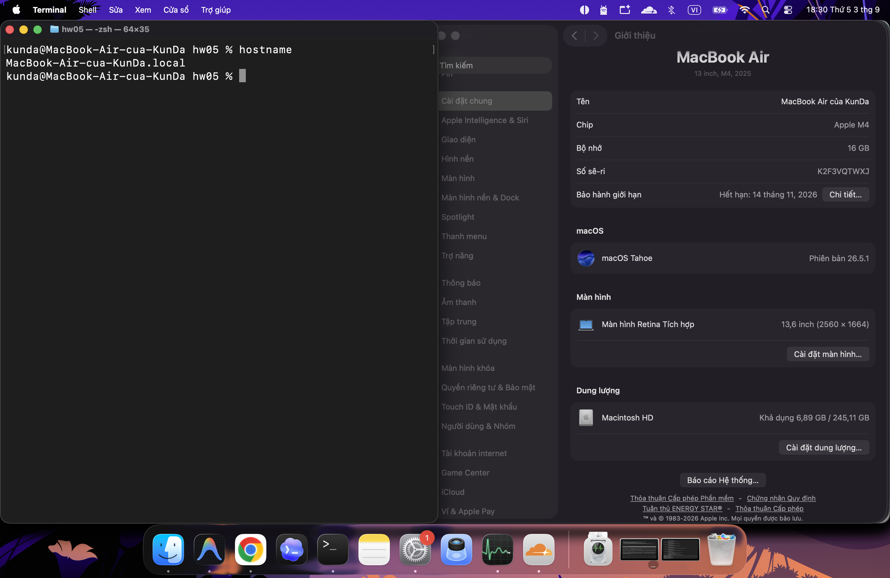
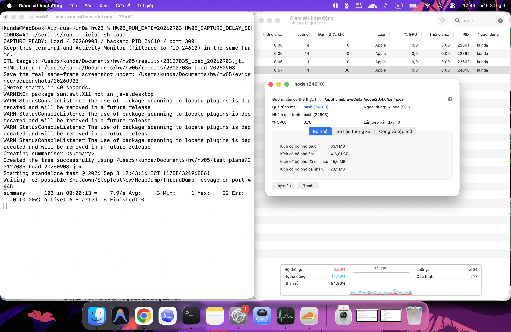
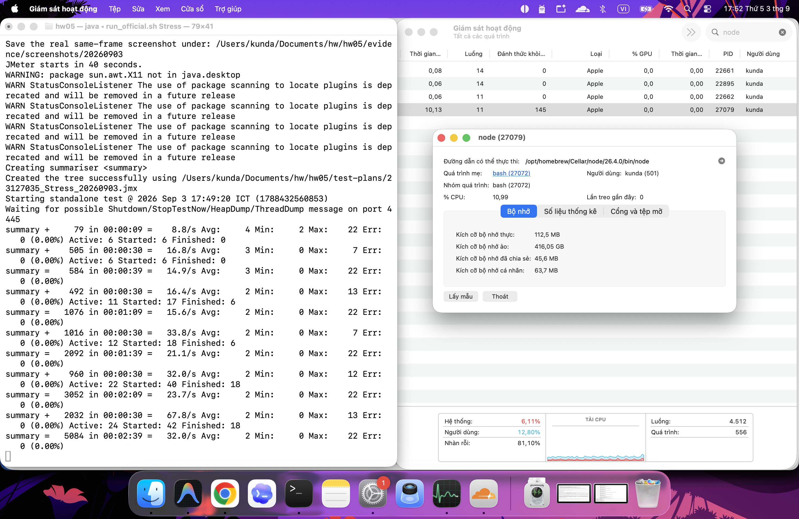
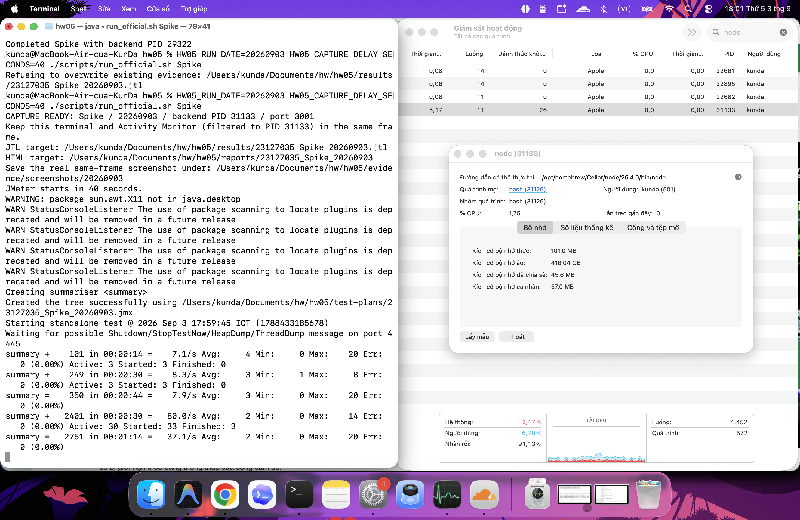
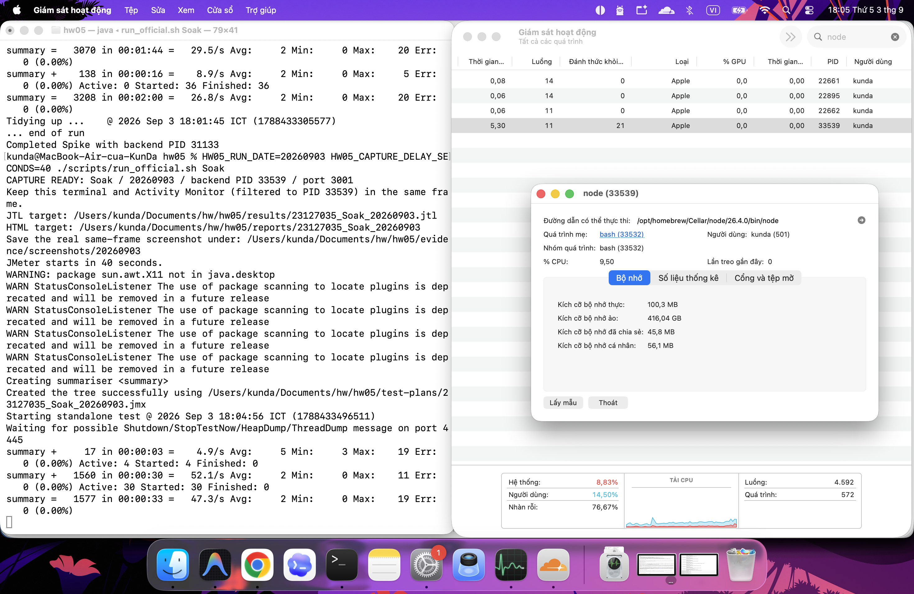
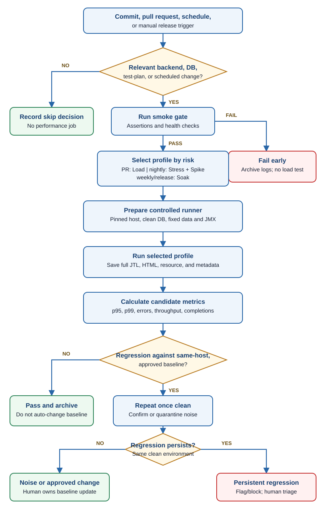

# HW05 Tasks 1-3 - Performance Test Design, Execution, AI Review, and Continuous Testing

**Student ID:** 23127035 
**Execution date:** 2026-09-03 
**Selected workflow:** WF-04 - Admin Login -> Import Product CSV -> Search Imported Product -> View Product Detail 
**Tool:** Apache JMeter 5.6.3 
**Task 1 demo:** [YouTube Unlisted](https://youtu.be/ukf1sTUyVuY) 
**Agent Skill demo:** [YouTube Unlisted](https://youtu.be/MxNkVFIW3Gk) 
**Public repository:** [GitHub - leekunda13/HW05](https://github.com/leekunda13/HW05) 
**Human review:** The student reviewed the four JMX plans, raw-log corrections, source-grounded optimization judgments, AI Critique, and hardware evidence.

## 1. Test environment and isolation

| Component | Actual value |
| --- | --- |
| Hostname | `MacBook-Air-cua-KunDa.local` |
| Hardware | MacBook Air `Mac16,12`, Apple M4, 10 cores, 16 GB RAM, arm64 |
| Operating system | macOS 26.5.1 (25F80), Darwin 25.5.0 |
| Backend | Node.js v26.4.0, Express 5.2.1, SQLite 3.51.0 |
| JMeter | 5.6.3, non-GUI mode |
| Measurement endpoint | `http://127.0.0.1:3001` |

The student-reviewed [hardware screenshot](evidence/hardware/sysinfo.png) confirms the hostname, Apple M4, 16 GB memory, and macOS 26.5.1.

## 2. Coherent end-to-end workflow

| Order | Feature/group | Request | Correlation and business assertion |
| ---: | --- | --- | --- |
| 1 | FR02 / auth-heavy | `POST /api/login` | HTTP 200; extract JWT, user ID, and role; require a non-empty token and `role=admin`. |
| 2 | FR16 / transactional write | `POST /api/admin/import-products` | Send the correlated Bearer token and a runtime-unique product; require `inserted=1`, empty errors, and `1/1` in the message. |
| 3 | FR05 / read-heavy | `GET /api/products?search=...` | Search the exact unique name; require exactly one match and correlate its product ID. |
| 4 | FR06 / read-heavy | `GET /api/products/{product_id}` | Use the correlated ID; require the same ID, name, and price as the imported product. |

The final detail lookup proves that the product created by FR16 is available through the catalogue read path. FR16 is write-heavy but the source does not wrap a batch in an explicit SQLite transaction, so it is not falsely described as atomic.

## 3. Data, correlation, and assertions

`data/performance_users.csv` has 80 synthetic admin accounts and the fields `email,password,product_prefix,product_price,product_description,product_image_url,category_id`. This exceeds peak concurrency of 30 VUs. Each iteration creates a unique product name from the CSV prefix, thread number, iteration number, and current millisecond.

CSV sharing is `All threads`, recycling is explicit, and one account is never concurrently shared at the tested peak. The JWT and product ID are extracted dynamically. Every sampler has an HTTP 200 assertion plus a business assertion; an HTTP response cannot pass merely because the socket completed. The shared 200-500 ms think-time timer is placed at Test Plan scope and therefore applies to all four actions in every thread group.

## 4. Workload models

| Plan | Workload | Listener/report view | Purpose |
| --- | --- | --- | --- |
| `23127035_Load_20260903.jmx` | 6 VUs, 15 s ramp, 120 s | Summary Report | Small stable interactive load after Smoke. |
| `23127035_Stress_20260903.jmx` | 6, 12, 24 VUs; 10 s ramp and 60 s per stage | Aggregate Report | Doubles concurrency and isolates degradation by stage. |
| `23127035_Spike_20260903.jmx` | 3 VUs/45 s, 30 VUs/30 s, 3 VUs/45 s recovery | View Results Tree, disabled during run | Abrupt tenfold burst followed by recovery. |
| `23127035_Soak_20260903.jmx` | 30 VUs, 30 s ramp, 410 iterations/thread | HTML dashboard/raw JTL | Completes 12,300 workflows in about ten minutes without relying on an unstable wall-clock scheduler. |

The Soak workload was retained at 30 VUs only after the real 30-VU Spike burst passed. Stop/invalidity conditions were backend exit, JMeter non-zero exit, any business assertion failure, missing raw/report evidence, or database state inconsistent with successful imports.

## 5. Execution, state control, and excluded attempt

Before every run the isolated backend recreated the canonical 2 users, 5 products, and 4 coupons. The runner required those counts to remain stable for three checks, inserted and verified exactly 80 admin accounts, captured pre-state, and sampled the exact Node PID once per second. Each accepted run therefore started with 82 users, 81 admins, 5 products, 0 orders, and 0 coupon-usage rows.

The 20260903 Smoke completed all four samplers with 0 failures and changed products from 5 to 6. Load, Stress, Spike, and Soak then ran from independent clean database states. Earlier 20260831/20260901 results remain historical evidence; capture attempts missing the required same-frame monitor are retained under `evidence/inconclusive` and are not mixed into the accepted baseline. The accepted Soak used 410 iterations per thread, completed exactly 12,300 workflows, and spanned 613.82 seconds in the JTL.

| Scenario | Screenshot |
| --- | --- |
| Load | [same-frame evidence](evidence/screenshots/20260903/23127035_Load_20260903_tool_resource.png) |
| Stress | [same-frame evidence](evidence/screenshots/20260903/23127035_Stress_20260903_tool_resource.png) |
| Spike | [same-frame evidence](evidence/screenshots/20260903/23127035_Spike_20260903_tool_resource.png) |
| Soak | [same-frame evidence](evidence/screenshots/20260903/23127035_Soak_20260903_tool_resource.png) |

### Same-frame execution evidence

## 6. Accepted results

Percentiles use nearest rank over JMeter `elapsed`. `Samples/s` counts HTTP samplers. The exact workflow count is the number of successful final FR06 detail samplers; it is not inferred by dividing total samples.

| Scenario | Samples | Failed | Error % | Mean ms | p90 ms | p95 ms | p99 ms | Samples/s | Exact workflows | Workflows/s | Peak CPU % | Peak RSS MB |
| --- | ---: | ---: | ---: | ---: | ---: | ---: | ---: | ---: | ---: | ---: | ---: | ---: |
| Load | 1,902 | 0 | 0.00 | 2.69 | 5 | 5 | 6 | 15.93 | 474 | 3.97 | 7.5 | 72.55 |
| Stress | 6,489 | 0 | 0.00 | 2.33 | 4 | 5 | 6 | 36.19 | 1,606 | 8.96 | 14.0 | 118.81 |
| Spike | 3,208 | 0 | 0.00 | 2.35 | 4 | 5 | 6 | 26.91 | 788 | 6.61 | 17.7 | 101.23 |
| Soak | 49,200 | 0 | 0.00 | 2.15 | 4 | 4 | 6 | 80.15 | 12,300 | 20.04 | 28.2 | 138.95 |

### Stage-level evidence

| Stage | Samples | Failed | p95 ms | Samples/s |
| --- | ---: | ---: | ---: | ---: |
| Stress 6 VUs | 933 | 0 | 5 | 15.74 |
| Stress 12 VUs | 1,851 | 0 | 5 | 31.09 |
| Stress 24 VUs | 3,705 | 0 | 4 | 62.08 |
| Spike baseline 3 VUs | 357 | 0 | 7 | 8.06 |
| Spike burst 30 VUs | 2,468 | 0 | 5 | 83.04 |
| Spike recovery 3 VUs | 383 | 0 | 5 | 8.66 |

Stress throughput scaled with concurrency while the 24-VU p95 was 4 ms and no assertion failed. Spike recovery returned to 8.66 samples/s and p95 5 ms, comparable to the 8.06 samples/s and p95 7 ms baseline.

## 7. Database and resource consistency

| Scenario | Products before | Successful FR16 imports | Products after | Consistent? |
| --- | ---: | ---: | ---: | --- |
| Load | 5 | 475 | 480 | Yes |
| Stress | 5 | 1,627 | 1,632 | Yes |
| Spike | 5 | 809 | 814 | Yes |
| Soak | 5 | 12,300 | 12,305 | Yes |

Resource figures are for the exact backend PID. macOS process CPU is not normalized across ten cores. RSS is resident memory; VSZ is not treated as physical usage. Soak RSS started at 66.59 MB, peaked at 138.95 MB, and ended at 69.39 MB, so the peak is not called a memory ceiling or a leak.

## 8. Endurance conclusion

The highest stable load observed was **30 VUs for 613.82 seconds**, completing **49,200 HTTP samples and 12,300 workflows** at **80.15 samples/s and 20.04 workflows/s**. Overall p95 was **4 ms**, p99 **6 ms**, error rate **0.00%**, peak Node CPU **28.2%**, and peak RSS **138.95 MB**.

The maximum elapsed value was 33 ms while p99 remained 6 ms. No tested stage reached failure or saturation, so 30 VUs is a lower-bound stable envelope, not absolute capacity.

## 9. Task 2 - AI analysis and misinterpretation review

| First-pass AI statement | Correct raw value | Why it is wrong |
| --- | --- | --- |
| “Soak sustained 79.49 workflows/s.” | The accepted rerun sustained **80.15 HTTP samples/s**, exactly **12,300** final samplers and **20.04 completed workflows/s** over 613.82 s. | JMeter's default rate counts HTTP samplers, not business journeys. |
| “Stress achieved 36.33 requests/s,” used as its peak. | Whole Stress is 36.19 samples/s, but the **24-VU stage is 62.08 samples/s**, p95 4 ms, 0 failures. | The whole value averages 6-, 12-, and 24-VU windows. |
| “Spike is slower than Stress, so the burst degraded throughput.” | The **30-VU burst reached 83.04 samples/s**, p95 5 ms; 26.91 is the whole test including two 3-VU periods. | Different workload windows are not comparable peak stages. |
| “Spike did not recover.” | Recovery was **8.66 samples/s, p95 5 ms**, versus baseline **8.06 samples/s, p95 7 ms**. | Recovery must be compared with the same 3-VU baseline, not the burst or whole-run average. |
| “The 1,151 ms maximum proves a tail-latency failure.” | The accepted rerun's maximum is **33 ms**, with p95 **4 ms** and p99 **6 ms** across 49,200 samples. | A maximum is not a percentile and the current accepted raw log does not contain the claimed 1,151 ms value. |
| “0% errors proves production capacity at 79 users/s.” | Evidence proves **30 VUs**, 0 failures, 80.15 samples/s, and 20.04 workflows/s. No stage reached collapse. | VUs, arrival rate, HTTP sample rate, and completed workflow rate are different quantities. |
| “Peak RSS 136.67 MB is the memory ceiling.” | Soak RSS start/peak/final is **66.59/138.95/69.39 MB**; first/last-quarter means are **99.05/77.05 MB**. | A transient peak followed by reclamation is neither an absolute ceiling nor proof of a leak. |
| “The suggested numbers are an SLA.” | Neither the assignment nor SUT defines a response-time/throughput SLA. | Local measurements support proposed regression gates only; product owners must approve service targets. |

## 10. Task 2 threshold proposal

| Metric/scope | Proposed rule | Basis |
| --- | --- | --- |
| Business correctness | Fail on any HTTP/business assertion failure. | Functional failures must not be averaged away. |
| Selected gated-scope p95 | Warn above 7.5 ms; fail above 10 ms. | +50%/+100% over the worst p95 (5 ms) across Load, Stress 24 VUs, Spike burst, and Soak. |
| Selected gated-scope p99 | Warn above 9 ms; fail above 12 ms. | +50%/+100% over the worst p99 (6 ms) across those scopes. |
| Load 6 VUs | Fail below 14.34 samples/s. | 10% below observed 15.93. |
| Stress 24 VUs | Fail below 55.87 samples/s. | 10% below observed 62.08. |
| Spike 30-VU burst | Fail below 74.74 samples/s. | 10% below observed 83.04. |
| Soak 30 VUs | Fail below 72.14 samples/s or 18.04 workflows/s. | 10% below observed 80.15 and 20.04. |
| Backend resources | Investigate above 35% Node CPU or 170 MB RSS; do not auto-fail. | Rounded bands above observed 28.2% and 138.95 MB peaks; host and GC dependent. |

These are proposed same-environment regression gates, not an SLA. Repeated clean runs must quantify natural variance before activation.

## 11. Task 2 optimization judgment

| Recommendation | Classification | Source-grounded judgment |
| --- | --- | --- |
| Wrap FR16 batch inserts in an explicit transaction. | **Feasible; prioritize experiment** | `server.js:209-240` prepares one statement but has no `BEGIN/COMMIT`. Benchmark multi-row imports and rollback behavior. |
| Enable SQLite WAL and `busy_timeout`. | **Feasible experiment, not guaranteed** | `database.js:5` opens one SQLite handle and defines no such PRAGMA. Measure writer contention and checkpoint behavior. |
| Add a non-unique index on `users(email)`. | **Feasible; profile first** | `database.js:50-61` has no email index; `server.js:35` performs equality login lookup, but only 82 users were present. |
| Add a B-tree index on `products(name)` for current search. | **Hallucinated as a direct fix** | `server.js:144` uses `LIKE '%term%'`; the leading wildcard generally prevents an ordinary prefix-index lookup. Profile with `EXPLAIN QUERY PLAN`; consider FTS5 or a requirement change. |
| Add another index on `coupons(code)`. | **Hallucinated/redundant** | `database.js:31` already declares `code TEXT UNIQUE`; coupon lookup is outside WF-04. |
| Add a conventional database connection pool. | **Hallucinated for current architecture** | The backend uses one in-process SQLite handle, not a client/server database; a PostgreSQL/MySQL-style pool is not a drop-in fix. |
| Cache exact product-search responses. | **Unsupported for this workload** | Every iteration imports a unique product and immediately reads it, producing little reuse and requiring correct invalidation. |
| Run clustered Node workers. | **Hallucinated as an immediate fix** | Multiple processes create multiple SQLite handles and may increase writer contention; no accepted result demonstrates a worker bottleneck. |

## 12. Task 3 - Continuous performance-testing model

The proposed pipeline watches commits but does not run every expensive profile on every change. Documentation/frontend-only changes record a skip decision. A relevant backend/auth/middleware pull request runs Smoke then Load; database/schema/SQL/import/dependency or test-data changes add Stress; nightly main runs add Stress and Spike; weekly and release-candidate runs add the 10-15 minute Soak. A maintainer may promote any change when path rules understate its risk.

Smoke must pass all HTTP and business assertions before performance traffic starts. The controlled runner then restores the canonical database, seeds the 80 accounts, and records the commit SHA, JMX/CSV hashes, hostname, CPU/RAM/OS, Node/JMeter versions, PID, and timestamps. Every job retains its full JTL, HTML report, backend log, resource CSV, database pre/post state, and run metadata. A failure therefore remains attributable to code, workload, data, and hardware rather than only to a dashboard number.

## 13. p95 regression and baseline ownership

The Task 2 thresholds are bootstrap candidate gates, not an SLA. Any assertion failure stops the pipeline. Across the selected gated scopes, p95 warns above 7.5 ms and fails above 10 ms after confirmation; p99 warns/fails above 9/12 ms. Candidate throughput floors are 14.34 samples/s at Load 6 VUs, 55.87 at Stress 24 VUs, 74.74 during the Spike burst, and 72.14 samples/s or 18.04 workflows/s for Soak. Node CPU above 35% or RSS above 170 MB triggers investigation, not an automatic failure based on one peak.

Before enforcement, at least three clean runs on the pinned runner establish a median and natural spread. A candidate p95 regression requires both a relative increase of at least 20% and an absolute increase of at least 2 ms, or it crosses the approved 10 ms hard band. This dual test prevents a quantized move from 4 to 5 ms being called severe merely because it is 25%. The pipeline repeats a candidate once from a clean state. A persistent regression flags the commit and may block release; a non-repeating result is quarantined for human review.

## 14. Cost and false-alarm trade-offs

| Trade-off | Risk | Control |
| --- | --- | --- |
| Execution cost and feedback time | All profiles on every commit delay pull requests. | Smoke + Load on relevant PRs; Stress/Spike nightly; Soak weekly/release. |
| Noisy neighbours | Other processes alter CPU, I/O, and latency. | Dedicated/pinned host, reject contaminated runs, repeat once clean. |
| Data drift | A growing SQLite file or reused state changes query/write cost. | Restore the versioned seed and verify pre/post counts. |
| Small latency values | A 1 ms change can appear as a large percentage. | Require relative and absolute deltas plus confirmation. |
| Broad aggregates | Overall throughput can hide a slow sampler or partial journey. | Compare per-sampler percentiles and exact final FR06 completions. |
| Hardware/version drift | Unlike environments produce invalid comparisons. | Version the fingerprint and compare only like-for-like runs. |
| Baseline ownership | Auto-rebaselining normalizes regressions. | Require human approval and retain old/new artifacts. |
| Artifact storage | Full JTL/HTML/resource evidence grows over time. | Preserve failures/releases; apply retention to passing PR artifacts. |

## 15. Deliverables and conclusion

The accepted baseline is the explicitly dated 20260903 set under `test-plans`, `results`, `reports`, and `evidence`. Older dated results remain historical and are not mixed into the current calculations. Reproducible Task 1 and Task 2 metrics are in `analysis/`; the unreviewed AI first pass is preserved under `audit/`; the detailed correction is in `task2_analysis_review.md`; and the Task 3 proposal/flow chart are in `task3_continuous_performance_proposal.md` and `assets/`.

## 16. AI Critique

During HW05, Codex accelerated source tracing, JMeter generation, execution, and raw-log calculation, but it initially optimized for endpoint coverage instead of business coherence. The first FR03-FR09-FR16 chain exercised authentication, coupon, write, and read APIs, yet password recovery, coupon validation, and admin import did not form one user goal. My team-workflow comparison exposed that weakness, and I replaced the plan with WF-04: an administrator logs in, imports a product, searches it, and opens the correlated detail record. AI also prepared artifacts with an earlier date until I required new evidence using the actual 20260903 execution date. A historical duration-scheduled soak was incorrectly treated as complete after a host-clock jump shortened its JTL window; retaining it as inconclusive and using 410 fixed iterations per thread removed that dependency. The accepted 20260903 soak produced 49,200 samples and exactly 12,300 completed workflows over 613.82 seconds. Task 2 exposed further semantic risk: 80.15 HTTP samples/s is not 80.15 workflows/s; counting successful final FR06 samplers gives 20.04 workflows/s. The earlier claim of a 1,151 ms maximum is also absent from the current accepted JTL, whose maximum is 33 ms, p95 is 4 ms, and p99 is 6 ms. Likewise, a 138.95 MB RSS peak followed by 69.39 MB final RSS is not a memory ceiling. Manual evidence capture exposed another boundary: AI could prepare PID-aware commands and verify images, but only I as the human tester could create genuine same-frame Activity Monitor evidence. These mistakes came from treating labels, configuration, and aggregate summaries as conclusions. The learned principle is evidence-gated collaboration: validate one coherent business goal, then verify dates, raw logs, state deltas, stage boundaries, exact workflow completion, resource context, and source feasibility before accepting AI claims.
